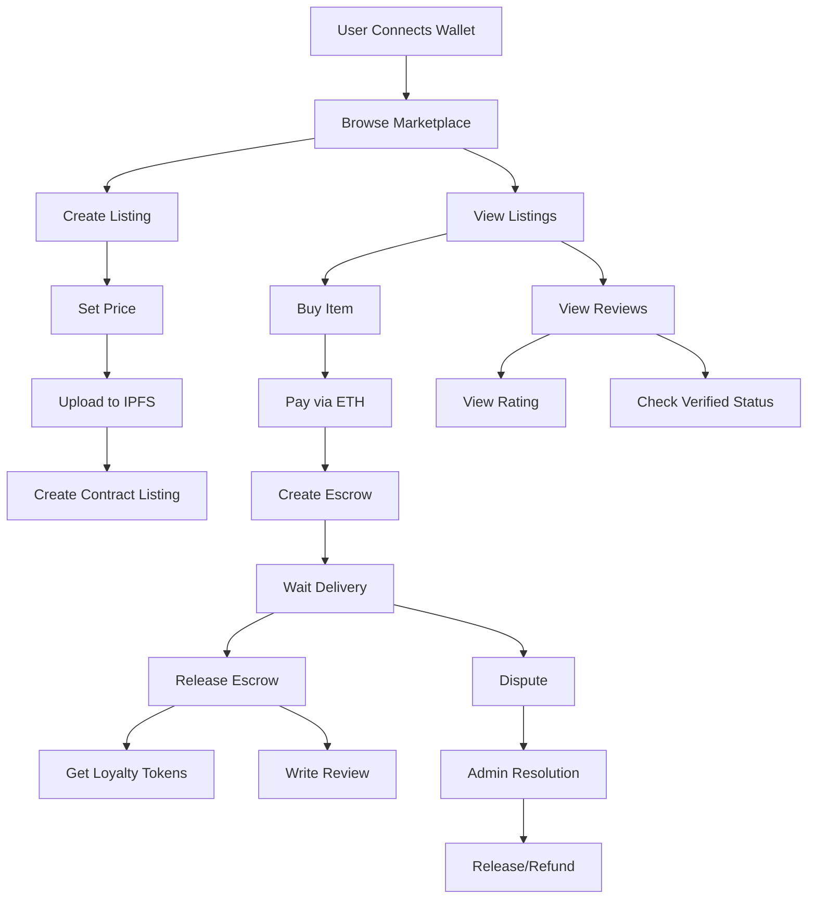

# Decentralized Marketplace

A Web3 marketplace enabling secure P2P buying and selling with cryptocurrency.

## Installation

### Prerequisites
- Node.js (v16+)
- npm/yarn
- MetaMask wallet

### Setup Steps
```bash
# Clone repository
git clone [repo-url]
cd [repo-name]

# Install dependencies
npm install

# Create environment file
cp .env.example .env
# Add keys to .env:
# INFURA_KEY=
# PRIVATE_KEY=
# ETHERSCAN_API_KEY=

# Compile contracts
npx hardhat compile

# Run tests
npx hardhat test

# Deploy locally
npx hardhat node
npx hardhat run scripts/deploy.ts --network localhost
```

## Architecture



## Features

### ✅ Completed
- [x] Core smart contracts
 - Marketplace: Product listing and buying
 - Escrow: Secure payment handling
 - Reviews: Verified feedback system
 - LoyaltyToken: ERC20 rewards
- [x] Testing & Security
 - Unit tests
 - Integration tests
 - Security features
 - Contract verification
- [x] Loyalty System
 - Token minting
 - Reward distribution
 - Balance tracking

### 🚧 Upcoming
- [ ] Frontend Build
 - React components
 - Web3 integration
 - Wallet connection
- [ ] IPFS Integration
 - Product metadata
 - Image storage
- [ ] User Features
 - Profiles
 - Dashboard
 - Search/Filter
 - Mobile support


